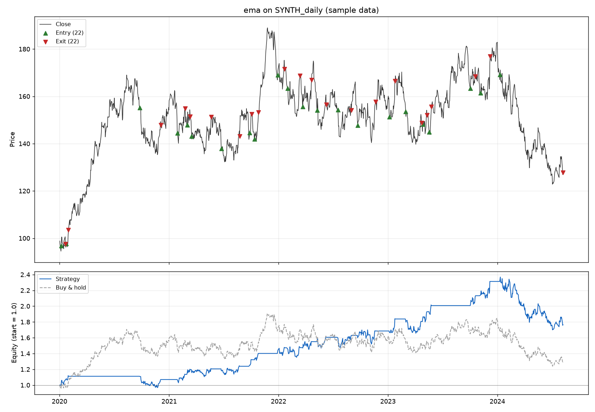

# trading-bot

A small backtesting engine for simple long-only strategies, built to be honest
about what it is measuring. It fetches historical prices, runs a strategy over
them, charges realistic trading costs, and compares the result against buying
and holding the same asset over the same period.



## Try it without an API key

The repository ships with sample data, so a clone runs immediately:

```bash
pip install -r requirements.txt
python -m tradingbot --fixture --strategy ema --plot chart.png
```

For real prices, get a free [AlphaVantage](https://www.alphavantage.co/support/#api-key)
key and drop the `--fixture` flag:

```bash
export ALPHAVANTAGE_API_KEY=your_key_here
python -m tradingbot --symbol AAPL --interval 1d --strategy breakout
```

Results are cached under `data/cache/`, because the free tier's rate limit is
easy to hit when you are iterating on a strategy.

## What it reports

```
Total return              76.63%        28.83%   (buy & hold)
CAGR                      13.17%         5.67%
Max drawdown             -28.24%       -35.00%
Sharpe                      0.87

Excess vs benchmark       47.80%
Time in market            51.17%

Trades                        22
Win rate                  86.36%
Average win                4.85%
Average loss              -9.70%
Payoff ratio                0.50

Exits           end_of_data 1, signal 21
```

## How it is put together

Four layers, each of which can be read, tested and changed on its own.

| Module | Responsibility |
| --- | --- |
| `data.py` | Fetch, cache, and normalise prices into one canonical shape |
| `strategies.py` | Pure functions from prices to a target position |
| `engine.py` | Fills, costs, risk rules, equity curve, benchmark |
| `metrics.py` | Statistics computed from an equity curve |
| `report.py` | Text summary and chart |

The reasoning behind the less obvious choices:

**Strategies return a target position, not buy and sell events.** A strategy
says "I want to be long here" and "I want to be flat here". It never says
"buy", because whether that means buying depends on what you already hold, and
that is the engine's business. This removes the position-tracking branch that
otherwise ends up copy-pasted into every strategy, and it means a strategy is
a pure function that can be tested without simulating a single trade.

**Orders fill at the next bar's open.** If you can see a bar's closing price,
you cannot also trade at it. The engine only ever acts on the bar after the one
that produced the signal. This is enforced in the engine rather than left to
the good intentions of whoever writes the next strategy, so no strategy can
accidentally trade on information it would not have had at the time.

**Every fill pays costs, and the default is not zero.** Commission and slippage
are charged on both sides, defaulting to 5 and 2 basis points. This matters
enormously and is easy to leave out. The same minute-bar strategy on the same
data returns **+0.10% with no costs and -3.48% with costs**, over 26 trades.
The strategy did not change. Only the honesty did.

**Risk rules live in the engine, not in the strategy.** Stop losses, take
profits and trailing stops need to know the entry price and the peak since
entry, which a stateless target position cannot know. Keeping them in the
engine means every strategy gets identical semantics, and any of them can be
switched off to check whether it was actually helping.

**There is always a benchmark.** A total return on its own is not a result. The
engine runs buy-and-hold through the same code path, over the same bars, paying
the same costs, and reports the difference. A strategy that returns 12% while
the asset returned 40% has not made you money, it has cost you 28%.

## Strategies

| Name | Idea | Parameters |
| --- | --- | --- |
| `ema` | Buy when price falls below its exponential moving average, sell when it rises above | `--period`, `--band` |
| `sma` | The same idea against a simple moving average | `--period`, `--band` |
| `breakout` | Hold while price stays within a drawdown of its running high | `--period`, `--band` |

Each is three or four lines, because everything that is not the idea itself
lives somewhere else. For example, the whole of the EMA strategy:

```python
def ema_reversion(df, period=60, band=0.02):
    ema = df["close"].ewm(span=period, adjust=False).mean()
    return _hysteresis(df["close"] < ema * (1 - band), df["close"] > ema * (1 + band))
```

## Tests

```bash
python -m pytest
```

55 tests, no network access, under a second. They run against hand-built price
series where the right answer can be worked out on paper, so a failure points
at the engine rather than at the data. The cases that matter most:

- A signal on the final bar produces no trade, because there is no next bar to
  fill against. This is the guard against lookahead.
- A signal at bar *i* fills at the open of bar *i+1*, asserted against the
  actual price.
- The same backtest at zero cost and at 10 basis points differs by exactly the
  expected amount.
- A trailing stop measures from the peak rather than from the entry.
- After a stop-out, a still-true signal does not immediately buy back in.

## Limitations

Worth stating plainly, because a backtest that hides these is worse than no
backtest at all.

- **Long or flat only.** No shorting, no leverage, no position sizing. Every
  trade is the full account.
- **Risk rules trigger on the close, not intrabar.** Checking the low would
  imply we know the path price took inside the bar and could have filled at
  exactly the stop level. Minute and daily data do not support that. Checking
  the close is the conservative reading: the exit comes later and at a worse
  price than a real resting order would probably get.
- **One asset at a time.** No portfolio construction or correlation.
- **The sample data is synthetic.** `tests/fixtures/` contains seeded random
  walks, not real prices, so that the project runs offline and the numbers in
  this README stay reproducible. They demonstrate the machinery. They say
  nothing whatsoever about whether these strategies work. A strategy beating
  buy-and-hold on one synthetic path is noise, not edge.
- **No survivorship bias handling, no dividends beyond AlphaVantage's split
  adjustment, no borrow costs, no market impact.**

**This is not a viable trading bot. Do not use it to make real trading
decisions.**

## Background

Originally written in 2021 as a first proper Python project, and rebuilt in
2025 around a cleaner separation between strategy, execution and reporting.
The original version had the strategy logic, the position state machine, the
profit calculation and the printing all inside a single class, duplicated three
times, which is how its stop loss came to be set to two different values in two
different files without anyone noticing.

Thanks to [Richard Moglen](https://www.youtube.com/channel/UCYqMAKiU3tFijWnyqAxG4Cg),
[Derrick Sherrill](https://www.youtube.com/channel/UCJHs6RO1CSM85e8jIMmCySw), and
[Trade Options With Me](https://www.youtube.com/channel/UCb0_-wF6yzHvjwkngWwBVTw),
whose channels pointed the original version in the right direction.
